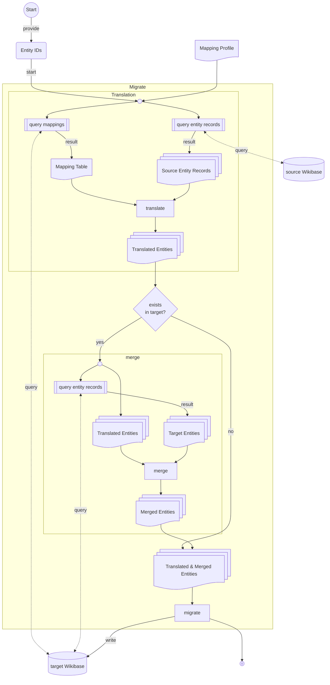

[](https://pypi.python.org/pypi/wikibasemigrator)
[](https://pypi.python.org/pypi/wikibasemigrator)
[](https://github.com/tholzheim/WikibaseMigrator/blob/master/LICENSE)
[](https://github.com/tholzheim/WikibaseMigrator/issues)
[](https://github.com/tholzheim/WikibaseMigrator/actions)
[](https://hub.docker.com/r/tholzheim/wbmigrator)
#  Wikibase Migrator

WikibaseMigrator is a tool to migrate wikibase entities from one wikibase instance to another. 
During the migration process all used Item and Property IDs are mapped to the IDs from the target Wikibase instance.

# Installation

```shell
pip install wikibasemigrator
```

## for Development

Install WikibaseMigrator after cloning with
```shell
pip install .
```
for development with
```shell
pip install .[test]
```

# How to use
* WikibaseMigrator offers a cli tool and a web UI.
* Migration is defined with a migration profile which needs to be defined. For details on the definition see [Wikibase Migration Profile Configuration](./docs/migration_profile_config.md)

## Docker

```commandline
docker run  -p 8009:8080 -v ~/.config/WikibaseMigrator/profiles/WikibaseMigrationTest.yaml:/config.yaml tholzheim/wbmigrator
```

> Exchange `~/.config/WikibaseMigrator/profiles/WikibaseMigrationTest.yaml` with the location of your migration profile configuration if needed 

## Web UI
The webserver can be started over the cli with 
```shell
 wbmigrate webserver --config FactGrid.yaml --host localhost --port 9100
```
or with docker 


## CLI Tool
After installing the project cli is available under the name `ẁbmigrate`
```shell
wbmigrate --help
```
```commandline
 Usage: wbmigrate [OPTIONS] COMMAND [ARGS]...                                                                 
                                                                                                              
╭─ Options ──────────────────────────────────────────────────────────────────────────────────────────────────╮
│ --install-completion          Install completion for the current shell.                                    │
│ --show-completion             Show completion for the current shell, to copy it or customize the           │
│                               installation.                                                                │
│ --help                        Show this message and exit.                                                  │
╰────────────────────────────────────────────────────────────────────────────────────────────────────────────╯
╭─ Commands ─────────────────────────────────────────────────────────────────────────────────────────────────╮
│ app         Run the WikibaseMigrator web server as local app Note: Experimental feature as some of the     │
│             imported resources are not localized yet                                                       │
│ webserver   Start the WikibaseMigrator web server                                                          │
│ migrate     Migrate the provided entities                                                                  │
╰────────────────────────────────────────────────────────────────────────────────────────────────────────────╯


```

### wbmigrate migrate
```shell
wbmigrate migrate --help
```
```commandline
 Usage: wbmigrate migrate [OPTIONS]                                                                           
                                                                                                              
 Migrate the provided entities                                                                                
                                                                                                              
╭─ Options ──────────────────────────────────────────────────────────────────────────────────────────────────╮
│ *  --config                               TEXT  The configuration file defining the Wikibases              │
│                                                 [default: None]                                            │
│                                                 [required]                                                 │
│ *  --summary                              TEXT  Summary message to add to the wikibase edits               │
│                                                 [default: None]                                            │
│                                                 [required]                                                 │
│    --entity                               TEXT  The items to migrate [default: None]                       │
│    --query                                TEXT  The query querying the items to migrate. The items to      │
│                                                 migrate must have the binding ?items                       │
│                                                 [default: None]                                            │
│    --query-file                           TEXT  The query file with a query querying the items to migrate. │
│                                                 The items to migrate must have the binding ?item           │
│                                                 [default: None]                                            │
│    --show-details    --no-show-details          Show detailed information during the migration process     │
│                                                 [default: no-show-details]                                 │
│    --force           --no-force                 If True migrate items directly to target wikibase          │
│                                                 [default: no-force]                                        │
│    --help                                       Show this message and exit.                                │
╰────────────────────────────────────────────────────────────────────────────────────────────────────────────╯


```

### wbmigrate webserver

```shell
wbmigrate webserver --help
```
```commandline
 Usage: wbmigrate webserver [OPTIONS]                                                                         
                                                                                                              
 Start the WikibaseMigrator web server                                                                        
                                                                                                              
╭─ Options ──────────────────────────────────────────────────────────────────────────────────────────────────╮
│ *  --config        TEXT     The configuration file defining the Wikibases [default: None] [required]       │
│    --host          TEXT     host of the webserver [default: 0.0.0.0]                                       │
│    --port          INTEGER  port of the webserver [default: 8080]                                          │
│    --help                   Show this message and exit.                                                    │
╰────────────────────────────────────────────────────────────────────────────────────────────────────────────╯
```

# Migration Pipeline

## Mering Entities
If an entity already exists in the target wikibase instance the source entity is first translated to the target and than merged with the target entity.
The merging of entities differs from the default wikibase entity merging for cases where the statement does not have qualifiers. In this case if the statement value is equal the qualifiers of the source are merged into the target. 
Otherwise, the merge results in an additional statement to preserve both qualifier information (equal to the wikibase entity merge)


# Acknowledgements
This project was funded by [FactGrid](https://database.factgrid.de)


# Licence <a id="license"></a>
This repository is licensed under the [Apache 2.0](./LICENSE)
